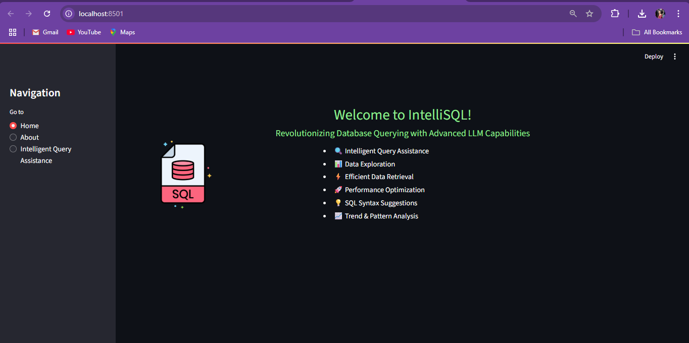
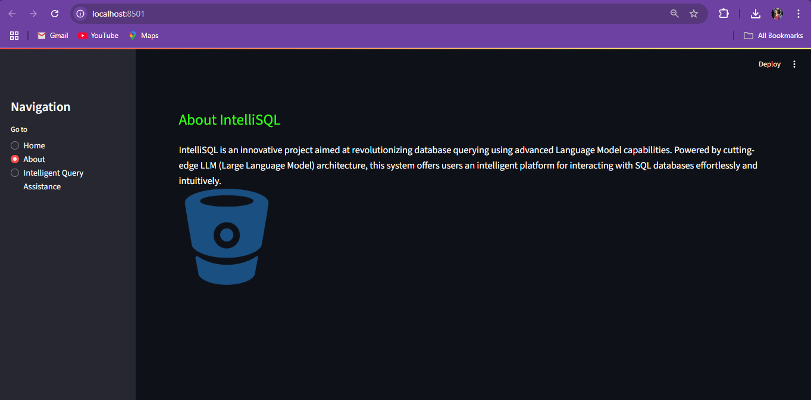
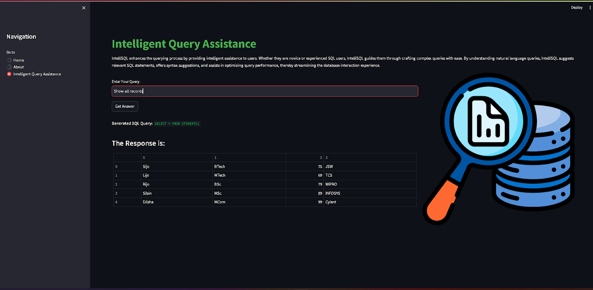

IntelliSQL: Intelligent SQL Querying with LLMs Using Gemini Pro
===============================================================

Project Overview
----------------
IntelliSQL is an AI-powered web application that enables users to interact with an SQL database using natural language. Built with Streamlit and integrated with Google's Gemini Pro large language model, IntelliSQL translates plain English questions into SQL queries, executes them on a student database, and displays the results. This empowers users—regardless of their SQL expertise—to explore and analyze data efficiently.

Features
--------
- Natural Language to SQL: Converts English questions into accurate SQL queries using Gemini Pro.
- Instant Data Retrieval: Executes generated queries and displays results in real time.
- User-Friendly Interface: Streamlit-based UI with clear navigation and modern styling.
- Sample Student Database: Pre-populated SQLite database for demonstration.
- Secure API Key Management: Uses `.env` files to keep credentials safe.
- Extensible Design: Easily adaptable for other databases or additional features.

Installation & Setup
--------------------
1. Clone the Repository:
   git clone https://github.com/your-username/IntelliSQL.git
   cd IntelliSQL

2. Create and Activate a Virtual Environment:
   python -m venv myenv
   # Windows:
   myenv\Scripts\activate
   # macOS/Linux:
   source myenv/bin/activate

3. Install Dependencies:
   pip install -r requirements.txt

4. Set Up Environment Variables:
   - Copy `.env.example` to `.env` and add your Gemini API key:
     API_KEY=your_gemini_api_key_here

5. Initialize the Database:
   python 1.sql.py

6. Run the Application:
   streamlit run app.py
   - Open the provided local URL in your browser.

Usage Instructions
------------------
1. Home Page:
   - View project introduction and key features.

2. About Page:
   - Learn about the project’s purpose and technology stack.

3. Intelligent Query Assistance:
   - Enter a question in plain English (e.g., "Show all students in BTech").
   - Click Get Answer to see the generated SQL query and the database results.

Screenshots
-----------
Below are sample screenshots from the application placed in  `screenshots/` folder and referenced as shown.

Home Page:

About Page:

Query Assistance Page:

Query Result Example:

Demo Video
----------
Placed in demo video in the `demo/` folder and linked as shown below:

[Click here to watch the demonstration video](demo/demo.mp4)

Credits
-------
- Project Developer: Atmikha Narayan
- LLM Integration: Google Gemini Pro
- UI Framework: Streamlit
- Version Control: GitHub
